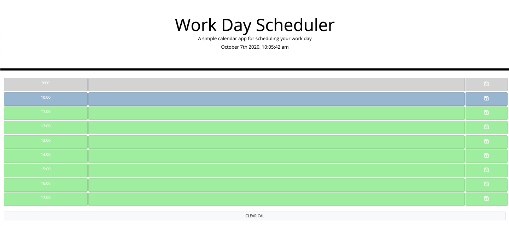

# jPlanner (Third Party APIs)

Create a simple calendar application that allows the user to save events for each hour of the day. This app will run in the browser and feature dynamically updated HTML and CSS powered by jQuery.

## User Story

AS AN employee with a busy schedule
I WANT to add important events to a daily planner
SO THAT I can manage my time effectively

## Demo of the Application

https://drive.google.com/file/d/10FwSCh5Cz00noYGmEDoTZnARsckute-u/view

## Access to the Application

* The URL of the deployed application.
https://andrewcircelli.github.io/jPlanner/

* The URL of the GitHub repository. Give the repository a unique name and include a README describing the project.
https://github.com/andrewcircelli/jPlanner

## Screnshot of the Application

<!-- Day Planner -->

